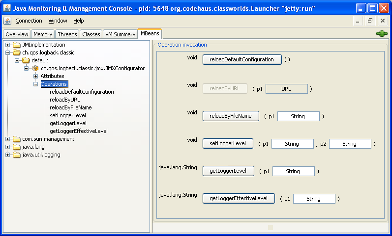
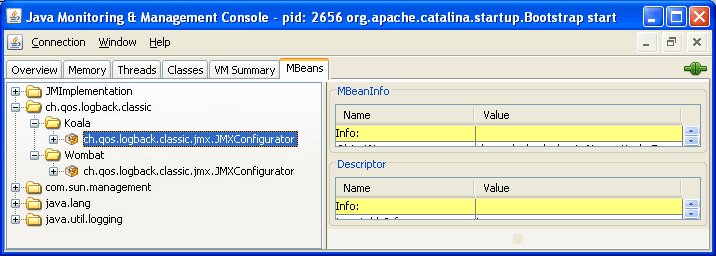
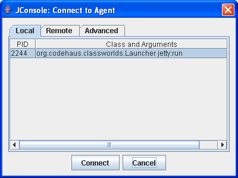
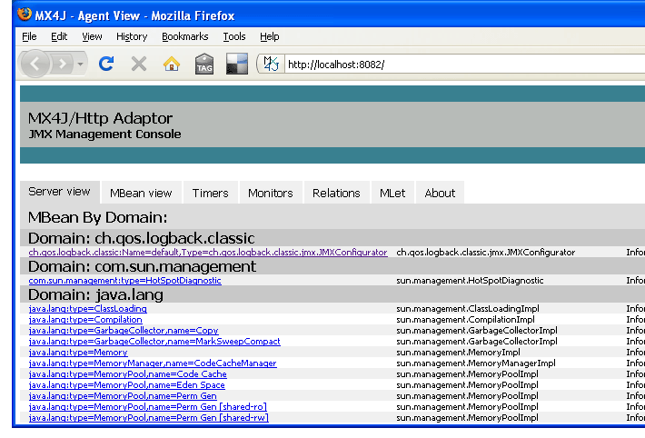
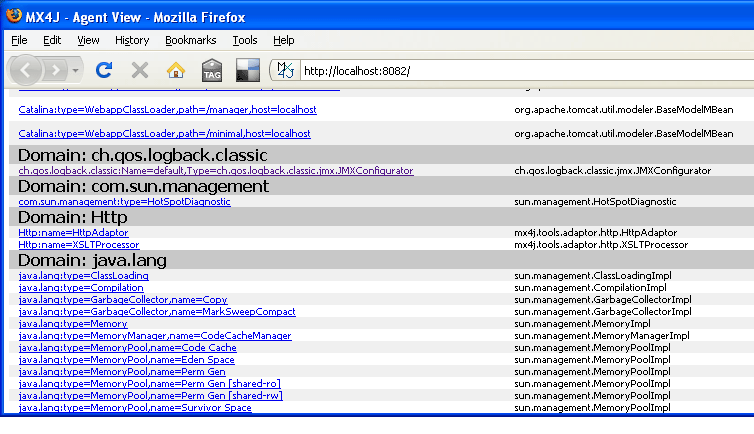

顾名思义，`JMXConfigurator` 允许通过 JMX 来配置 logback。简单来说就是，它允许你从默认配置文件，指定的文件或者 URL 重新配置 logback，列出 logger 以及修改 logger 级别。

### 使用 JMX 配置器

如果你的运行在 JDK 1.6 或者更高的版本，那么你仅仅需要在命令行调用 `jconsole`，然后连接到你服务器上的 MBeanServer。如果你运行在老版本的 JVM 上，那么你需要查看[在服务上使用 JMX](https://logback.qos.ch/manual/jmxConfig.html#jmxEnablingServer)。

在配置文件中开启 `JMXConfigurator` 只需要一行。如下：

```xml
<configuration>
  <jmxConfigurator />
  
  <appender name="console" class="ch.qos.logback.core.ConsoleAppender">
    <layout class="ch.qos.logback.classic.PatternLayout">
      <Pattern>%date [%thread] %-5level %logger{25} - %msg%n</Pattern>
    </layout>
  </appender>

  <root level="debug">
    <appender-ref ref="console" />
  </root>  
</configuration>
```

在你通过 *jconsole* 连接到服务器上之后，在 MBeans 面板上，在 "ch.qos.logback.classic.jmx.Configurator" 文件夹下你可以看到几个选项。如下图所示：

### 在 `jconsole` 中查看 `JMXConfigurator` 的截图



所以，你可以

-   使用默认配置文件重新加载 logback 的配置
-   通过指定的 URL 重新加载配置
-   通过指定的文件重新加载配置
-   设置指定的 logger 的级别。想要设置为 null，传递 "null" 字符串就可以
-   获取指定 logger 的级别。返回值可以为 null
-   或者指定 logger 的[有效级别](https://github.com/daichangya/logback-doc/blob/master/02%E7%AC%AC%E4%BA%8C%E7%AB%A0%EF%BC%9A%E6%9E%B6%E6%9E%84.md#%E6%9C%89%E6%95%88%E7%AD%89%E7%BA%A7%E5%8F%88%E7%A7%B0%E4%B8%BA%E7%AD%89%E7%BA%A7%E7%BB%A7%E6%89%BF)

`JMXConfigurator` 将已经存在的 logger 以及状态当作属性进行展示。

这个状态列表可以帮助你诊断 logger 的内部状态。


### 避免内存泄漏

如果你的应用部署在 web 服务器或者应用服务器上，注册的 `JMXConfigurator` 实例会从系统类加载器创建一个引用到你的应用中。在应用停止或者重新部署事，它会阻止垃圾回收，那么将会导致内存泄漏。

因此，除非你的应用是单机的 Java 应用，否则的话，你必须从 JVM 的 Mbeans 服务上注销 `JMXConfigurator` 实例。通过 `LoggerContext` 调用 `reset()` 方法将会自动注销任何 JMXConfigurator 实例。一个好的方法去重置 logger 上下文是通过 `javax.servlet.ServletContextListener` 中的 `contextDestroyed()` 方法。示例代码如下：

```java
import javax.servlet.ServletContextEvent;
import javax.servlet.ServletContextListener;

import org.slf4j.LoggerFactory;
import ch.qos.logback.classic.LoggerContext;

public class MyContextListener implements ServletContextListener {

  public void contextDestroyed(ServletContextEvent sce) {
    LoggerContext lc = (LoggerContext) LoggerFactory.getILoggerFactory();
    lc.stop();
  }

  public void contextInitialized(ServletContextEvent sce) {
  }
} 
```

## `JMXConfigurator` 与多个 web 应用

如果你在同一个服务器上部署了多个 web 应用，并且你没有重写默认的[上下文选择器](https://github.com/daichangya/logback-doc/blob/master/09%E7%AC%AC%E4%B9%9D%E7%AB%A0%EF%BC%9A%E6%97%A5%E5%BF%97%E9%9A%94%E7%A6%BB.md#%E4%B8%8A%E4%B8%8B%E6%96%87%E9%80%89%E6%8B%A9%E5%99%A8)，以及你把 *logback-\*.jar* 与 *slf4j-api.jar* 放到了每个 web 应用的 *WEB-INF/lib* 文件夹下。之后默认每个 `JMXConfigurator` 实例将会注册在同一个名字下。也就是 "ch.qos.logback.classic:Name=default,Type=ch.qos.logback.classic.jmx.JMXConfigurator" 。换句话说，在你每个 web 应用中，默认各种 `JMXConfigurator` 实例关联的 logger 上下文将会冲突。

为了避免这种不必要的冲突，你仅仅需要[设置应用的日志上下文](https://github.com/daichangya/logback-doc/blob/master/03%E7%AC%AC%E4%B8%89%E7%AB%A0%EF%BC%9Alogback%20%E7%9A%84%E9%85%8D%E7%BD%AE.md#%E8%AE%BE%E7%BD%AE-context-%E7%9A%84%E5%90%8D%E5%AD%97)，`JMXConfigurator` 将会自动使用你设置好的名字。

例如，如果部署两个名为 "Koala" 与 "Wombat" 的 web 应用，那么你可以在 Koala 的配置文件中这样写：

```xml
<configuration>
  <contextName>Koala</contextName>
  <jmxConfigurator/>
  ...
<configuration>
```

在 Wombat 的配置文件中，你可以这样写：

```xml
<configuration>
  <contextName>Wombat</contextName>x
  <jmxConfigurator/>
  ...
<configuration>
```

在 jconsole 的 MBeans 面板中，你可以看到两个不同的 `JMXConfigurator` 实例：



通过 <jmxConfigurator> 元素的 "objectName" 属性，你可以完全控制注册到 MBeans 服务中 JMXConfigurator 的名字。

### 在服务器中开启 JMX

如果你的服务器运行在 JDK 1.6 或者更高版本，那么 JMX 默认开启。

对于旧版的 JVM，我们建议你参考你所使用的 web 服务器上 JMX 相关的文档。这些文档在 [Tomcat](http://tomcat.apache.org/tomcat-6.0-doc/monitoring.html) 以及 [Jetty](http://docs.codehaus.org/display/JETTY/JMX) 中都可以获得。在这个文档中，我们将会详细叙述 Tomcat 与 Jetty 相关的配置步骤。

#### 在 Jetty 中开启 JMX (在 JDK 1.5 以及 JDK 1.6 测试过)

接下来的已经在 JDK 1.5 及 1.6 中测试过。在 JDK 1.6 以及以后的版本中，你的服务器是默认开启 JMX 的，你可以但是不需要遵循下面所讨论的。在 JDK 1.5 下，添加 JMX 支持，只需要在 *$JETTY_HOME/etc/jetty.xml* 配置文件中添加一个额外的支持。下面是需要被添加的元素：

```xml
<Call id="MBeanServer" class="java.lang.management.ManagementFactory" 
      name="getPlatformMBeanServer"/>

<Get id="Container" name="container">
  <Call name="addEventListener">
    <Arg>
      <New class="org.mortbay.management.MBeanContainer">
        <Arg><Ref id="MBeanServer"/></Arg>
        <Call name="start" />
      </New>
    </Arg>
  </Call>
</Get>
```

如果你想通过 `jconsole` 访问 Jetty 中的 MBeans，那么你需要在启动 Jetty 前设置系统属性 "com.sun.management.jmxremote"。

对于单机版本的 Jetty，通过：

```java
java -Dcom.sun.management.jmxremote -jar start.jar [config files]
```

如果你想将 Jetty 作为 Maven 插件启动，那么你需要通过 `MAVEN_OPTS` shell 变量设置系统属性 "com.sun.management.jmxremote"：

```java
MAVEN_OPTS="-Dcom.sun.management.jmxremote"
mvn jetty:run
```

你可以通过 `jconsole` 访问 Jetty 的 MBeans 以及 logback 的 `JMXConfigurator`。



在你连接上以后，你可以访问 `JMXConfigurator`，就像上面的[截图](https://github.com/daichangya/logback-doc/blob/master/10%E7%AC%AC%E5%8D%81%E7%AB%A0%EF%BC%9AJMX%20%E9%85%8D%E7%BD%AE%E5%99%A8.md#%E5%9C%A8-jconsole-%E4%B8%AD%E6%9F%A5%E7%9C%8B-jmxconfigurator-%E7%9A%84%E6%88%AA%E5%9B%BE)一样。

#### MX4j 与 Jetty (在 JDK 1.5 以及 1.6 测试过)

假设你已经下载了 [MX4J](http://mx4j.sourceforge.net/)，你想要通过 MX4J 的 HTTP 接口访问 `JMXConfigurator`，你需要添加之前讨论过的配置，并且设置 managementPort。

```xml
<Call id="MBeanServer"
    class="java.lang.management.ManagementFactory"
    name="getPlatformMBeanServer"/>

<Get id="Container" name="container">
  <Call name="addEventListener">
    <Arg>
      <New class="org.mortbay.management.MBeanContainer">
        <Arg><Ref id="MBeanServer"/></Arg>
        <Set name="managementPort">8082</Set>
        <Call name="start" />
      </New>
    </Arg>
  </Call>
</Get> 
```

而且，*mx4j-tools.jar* 需要添加到 Jetty 的类路径下。

如果你想将 Jetty 作为 Maven 的插件运行，那么你需要添加 *mx4j-tools* 作为依赖。

```xml
<plugin>
  <groupId>org.mortbay.jetty</groupId>
  <artifactId>maven-jetty-plugin</artifactId>
  <configuration>
    <jettyConfig>path/to/jetty.xml</jettyConfig>
    ...
  </configuration>
  <dependencies>
    <dependency>
      <groupId>mx4j</groupId>
      <artifactId>mx4j-tools</artifactId>
      <version>3.0.1</version>
    </dependency>
  </dependencies>
</plugin>
```

在通过以上配置启动了 Jetty 之后，可以通过如下的 URL 访问 `JMXConfigurator` (查找 "ch.qos.logback.classic")：

```http
http://localhost:8082/
```

下面是通过 MX4J 接口访问的截图信息：



#### 在 Tomcat 配置 JMX (在 JDK 1.5 以及 1.6 测试过)

如果你使用 JDK 1.6 以及以后的版本，你的服务器是默认开启 JMX 的，你可以但是不需要遵循下面所讨论的。在 JDK 1.5 下，需要在 Tomcat 的 *$TOMCAT_HOME/bin/catalina.bat/sh* shell 脚本中添加如下的行：

```shell
CATALINA_OPTS="-Dcom.sun.management.jmxremote"
```

一旦通过这些配置启动后，可以通过在命令行输入如下命令来获取 Tomcat 的 MBeans 以及 logback 的 `JMXConfigurator`：

```shell
jconsole
```


在你连接上以后，你可以访问 `JMXConfigurator`，就像上面的[截图](https://github.com/daichangya/logback-doc/blob/master/10%E7%AC%AC%E5%8D%81%E7%AB%A0%EF%BC%9AJMX%20%E9%85%8D%E7%BD%AE%E5%99%A8.md#%E5%9C%A8-jconsole-%E4%B8%AD%E6%9F%A5%E7%9C%8B-jmxconfigurator-%E7%9A%84%E6%88%AA%E5%9B%BE)一样。

#### MX4J 与 Tomcat (在 JDK 1.5 以及 1.6 测试过)

你可能想要通过 MX4J 提供的 web 接口访问 JMX 组件。在这种情况下，下面是必须的步骤：

假设你已经下载了 [MX4J](http://mx4j.sourceforge.net/)，将 *mx4j-tools.jar* 文件放到了 *$TOMCAT_HOME/bin/* 文件夹下。那么，添加如下的行到 *$TOMCAT_HOME/bin/catalina.sh* 配置文件中：

```shell
<!-- at the beginning of the file -->
CATALINA_OPTS="-Dcom.sun.management.jmxremote"

<!-- in the "Add on extra jar files to CLASSPATH" section -->
CLASSPATH="$CLASSPATH":"$CATALINA_HOME"/bin/mx4j-tools.jar
```

最后，在 *$TOMCAT_HOME/conf/server.xml* 文件中声明一个新的 `Connector`：

```xml
<Connector port="0" 
  handler.list="mx"
  mx.enabled="true" 
  mx.httpHost="localhost" 
  mx.httpPort="8082" 
  protocol="AJP/1.3" />
```

一旦 Tomcat 启动后，你可以通过访问如下的 URL 找到 JMXConfigurator (查找 "ch.qos.logback.classic")：

下面是通过 MX4J 接口访问得到的截图：



